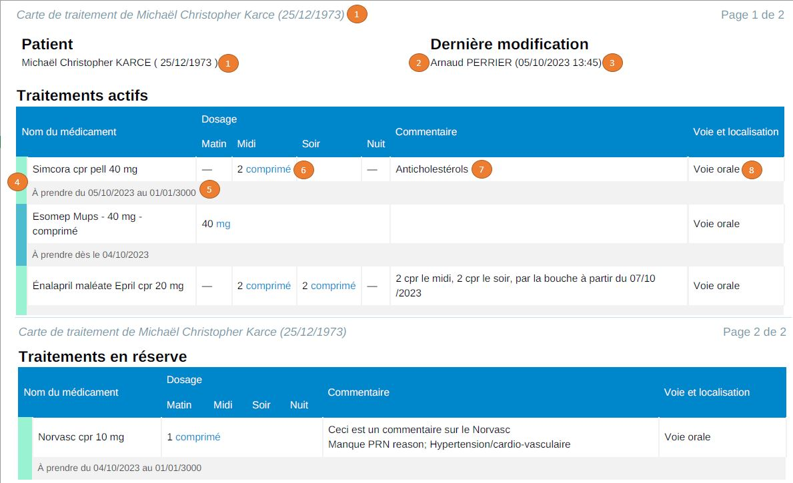

# Aggregation
## Concepts
|Term|Definition|References|
|----|----------|----------|
|Medication plan (current medication)|The medication plan is the documentation of all the medication information for a patient at a certain point of time. The medication plan can be presented as a [medication card](https://github.com/ehealthsuisse/EPD-by-example/blob/main/files/MedicationCardDocument.md) or as an [eMediplan](https://emediplan.ch/) (eMediplan is not supported by the service, it is another way of displaying the medication plan).|See [IHE Pharmacy Community Medication List (PML)](https://www.ihe.net/uploadedFiles/Documents/Pharmacy/IHE_Pharmacy_Suppl_PML.pdf) and IPAG's definition ([FR](https://www.fmh.ch/files/pdf24/rapport-gtip-ipag-sur-la-cybermedication.pdf), [DE](https://www.fmh.ch/files/pdf24/ipag-bericht-emedikation.pdf)), § 2.1 and § 2.5.|
|Medication treatment|A medication treatment corresponds to one single medication the patient was planned to take in the past or is planned to take presently or in the future, including its name, dosage, frequency of intake, etc. Medication treatments are created every time an [MTP document](https://build.fhir.org/ig/CARA-ch/ch-emed-epr/document_mtp.html) is received.  This service considers two kinds of medication treatments: "simple" and "prescribed".  Simple medication treatments are created with just one [MTP document](https://build.fhir.org/ig/CARA-ch/ch-emed-epr/document_mtp.html) (by the patient or a healthcare professional).  Prescribed medication treatments are created by healthcare professionals only, with an [MTP document](https://build.fhir.org/ig/CARA-ch/ch-emed-epr/document_mtp.html) followed by a [PRE document](https://build.fhir.org/ig/CARA-ch/ch-emed-epr/document_pre.html).|See [IHE Pharmacy MTP supplement](https://www.ihe.net/uploadedFiles/Documents/Pharmacy/IHE_Pharmacy_Suppl_MTP.pdf), as well as [HL7's Medication Treatment Plan FHIR document](https://build.fhir.org/ig/hl7ch/ch-emed//medication-treatment-plan-document.html).|
|Medication treatment instance|A medication treatment instance is a concept of this eMedication service.   A medication treatment can change over time: the dosage, medication, active substance, comments, etc. can be updated.  The medication treatment instance represents the state of a medication at a current point of time.  Medication treatment instance creation depends on the type of medication treatment. For "simple" (ie. not prescribed) treatments, a single medication treatment instance is created when the [MTP document](https://build.fhir.org/ig/CARA-ch/ch-emed-epr/document_mtp.html) is received.   For _prescribed_ medication treatments (ie. medication treatments for which there is a [MTP document](https://build.fhir.org/ig/CARA-ch/ch-emed-epr/document_mtp.html) and at least one  [PRE document](https://build.fhir.org/ig/CARA-ch/ch-emed-epr/document_pre.html)), a new instance is created every time a [PRE document](https://build.fhir.org/ig/CARA-ch/ch-emed-epr/document_pre.html) is received. Each medication treatment instance appears in a single line within the medication card. Instances associated with the same treatment are visually grouped.|-|
|Medication statement|A medication statement represents a given medication (form, dosage, GTIN/ATC, ingredients etc.)|See the [definition in the implementation guide](https://build.fhir.org/ig/CARA-ch/ch-emed-epr/StructureDefinition-ch-emed-epr-medicationstatement-treatmentplan.html).|
|Aggregation|The aggregation is the process of determining the current state of each medication treatment within a patient's medication plan, based on the existing medication treatment instances. This is done depending on the document triggering the aggregation, either by updating existing medication treatments /  medication treatment instances, or by creating new medication treatment instances|-|

## Triggers
Aggregation occurs when:

* A new [emed document](../emed/index.md) is provided via the [ITI-41 transaction](../transactions/iti41.md).
* An [emed document](../emed/index.md) is removed via the [ITI-57 transaction](../transactions/iti57.md).
* An [emed document](../emed/index.md) is replaced via the [ITI-41 transaction](../transactions/iti41.md) and the [replace](https://profiles.ihe.net/ITI/TF/Volume3/ch-4.1.html#4.1.2.2) association.

## Scope
When triggered, aggregation occurs for the medication treatment referenced by the triggering document.

When the triggering document is a [PRE](https://build.fhir.org/ig/CARA-ch/ch-emed-epr/document_pre.html), it might reference several medication treatments (multi-prescription). In this case the service applies the aggregation process to each referenced medication treatment.

## Aggregation process
### Overview
The table below shows an overview of the elements updated or created during the aggregation process.
<html>
<head>
  
</head>

<body>
  <table>
    <tr>
      <td colspan="4" class="header0">Document triggering the aggregation</td>
      <td rowspan="3" class="header1">MTP</td>
      <td rowspan="3" class="header1">PRE</td>
      <td rowspan="3" class="header1">DIS</td>
      <td colspan="11" class="header1">PADV</td>
    </tr>
    <tr>
      <td></td>
      <td rowspan="2" class="header2">Attribute</td>
      <td rowspan="2" class="header2">Description</td>
      <td rowspan="2" class="header2">Reference on medication card</td>
      <td colspan="2" class="header1">COMMENT</td>
      <td colspan="2" class="header1">OK</td>
      <td class="header1">SUSPEND</td>
      <td colspan="2" class="header1">CHANGE</td>
      <td colspan="2" class="header1">CANCEL</td>
      <td colspan="2" class="header1">REFUSE</td>
    </tr>
    <tr>
      <td></td>
      <td class="header1">Target MTP</td>
      <td class="header1">Target any other document</td>
      <td class="header1">Target MTP</td>
      <td class="header1">Target PRE</td>
      <td class="header1">Can only target MTP</td>
      <td class="header1">Target MTP</td>
      <td class="header1">Target PRE</td>
      <td class="header1">Target MTP</td>
      <td class="header1">Target PRE</td>
      <td class="header1">Target MTP</td>
      <td class="header1">Target PRE</td>
    </tr>
    <tr>
      <td rowspan=10 class="header1">Medication treatment</td>
      <td colspan=3 class="header3">Operation</td>
      <td class="header3">Create new Medication Treatment.</td>
      <td class="header3">Retrieve instance(s) associated with referenced treatment and
        patient.</td>
      <td class="header3">Retrieve instance associated with referenced treatment and
        patient.  
        Validate that the incoming dispense references a prescription if the
        medication treatment is in prescribed state.</td>
      <td colspan=11 class="header3">Retrieve instance associated with referenced treatment and
        patient.</td>
    </tr>
    <tr>
      <td class="header4">comments</td>
      <td class="header4">The list of comments made on the treatment itself (referencing
        the MTP entry). Prescription comments will be recorded on the medication
        treatment instance.</td>
      <td class="ref">7</td>
      <td class="none">-</td>
      <td class="none">-</td>
      <td class="none">-</td>
      <td class="add">Add comment from PADV.</td>
      <td class="none">-</td>
      <td class="add">Add comment from PADV.</td>
      <td class="none">-</td>
      <td class="add">Add comment from PADV.</td>
      <td class="add">Add comment from PADV.</td>
      <td class="none">-</td>
      <td class="add">Add comment from PADV.</td>
      <td class="none">-</td>
      <td class="add">Add comment from PADV.</td>
      <td class="none">-</td>
    </tr>
    <tr>
      <td class="header4">dispenses</td>
      <td class="header4">The list of dispenses targeting the MTP associated with this
        treatment, or any of its related PRE.</td>
      <td class="ref">-</td>
      <td class="none">-</td>
      <td class="none">-</td>
      <td class="add">Add new dispense entry referencing incoming DIS document.</td>
      <td class="none">-</td>
      <td class="none">-</td>
      <td class="none">-</td>
      <td class="none">-</td>
      <td class="none">-</td>
      <td class="none">-</td>
      <td class="none">-</td>
      <td class="none">-</td>
      <td class="none">-</td>
      <td class="none">-</td>
      <td class="none">-</td>
    </tr>
    <tr>
      <td class="header4">instances</td>
      <td class="header4">The list of medication treatment instances associated with this
        medication treatment.</td>
      <td class="ref">-</td>
      <td class="add">Add new instance.</td>
      <td class="add">Add new instance if the treatment is &quot;prescribed&quot; (ie.
        There is already a Medication treatment instance related to a PRE associated
        with this medication treatment).</td>
      <td class="none">-</td>
      <td class="none">-</td>
      <td class="none">-</td>
      <td class="none">-</td>
      <td class="none">-</td>
      <td class="none">-</td>
      <td class="none">-</td>
      <td class="none">-</td>
      <td class="none">-</td>
      <td class="none">-</td>
      <td class="none">-</td>
      <td class="none">-</td>
    </tr>
    <tr>
      <td class="header4">id</td>
      <td class="header4">Globally unique id of this medication treatment.</td>
      <td class="ref">-</td>
      <td class="add">Initialize withg MTP treatment id.</td>
      <td class="none">-</td>
      <td class="none">-</td>
      <td class="none">-</td>
      <td class="none">-</td>
      <td class="none">-</td>
      <td class="none">-</td>
      <td class="none">-</td>
      <td class="none">-</td>
      <td class="none">-</td>
      <td class="none">-</td>
      <td class="none">-</td>
      <td class="none">-</td>
      <td class="none">-</td>
    </tr>
    <tr>
      <td class="header4">mpiPid</td>
      <td class="header4">Reference to patient.</td>
      <td class="ref">1</td>
      <td class="add">Initialize with MTP's patient reference.</td>
      <td class="none">-</td>
      <td class="none">-</td>
      <td class="none">-</td>
      <td class="none">-</td>
      <td class="none">-</td>
      <td class="none">-</td>
      <td class="none">-</td>
      <td class="none">-</td>
      <td class="none">-</td>
      <td class="none">-</td>
      <td class="none">-</td>
      <td class="none">-</td>
      <td class="none">-</td>
    </tr>
    <tr>
      <td class="header4">mtpReference</td>
      <td class="header4">Reference to the MTP associated with this medication treatment.</td>
      <td class="ref">4</td>
      <td class="add">Initialize with reference to incoming MTP.</td>
      <td class="none">-</td>
      <td class="none">-</td>
      <td class="none">-</td>
      <td class="none">-</td>
      <td class="none">-</td>
      <td class="none">-</td>
      <td class="none">-</td>
      <td class="none">-</td>
      <td class="none">-</td>
      <td class="none">-</td>
      <td class="none">-</td>
      <td class="none">-</td>
      <td class="none">-</td>
    </tr>
    <tr>
      <td class="header4">status</td>
      <td class="header4">Status of the treatment. Can be active, suspended, canceled or
        refused. 
        The status is not shown on the medication card, it is used to select the
        treatments to display.</td>
      <td class="ref">-</td>
      <td class="add">Initialize &quot;active&quot;.</td>
      <td class="check">Check value: must be active (not updated).</td>
      <td class="none">-</td>
      <td class="none">-</td>
      <td class="none">-</td>
      <td class="update">Set &quot;active&quot; if it was &quot;active&quot; or
        &quot;suspended&quot;.</td>
      <td class="none">-</td>
      <td class="update">Set to &quot;suspended&quot; document referenced by PADV is a MTP
        and if it was in &quot;active&quot; state.</td>
      <td class="update">Set &quot;active&quot; if previous value was &quot;active&quot; or &quot;suspended&quot;.</td>
      <td class="none">-</td>
      <td class="update">Set &quot;cancel&quot; if previous value was not
        &quot;active&quot; or &quot;suspended&quot;.</td>
      <td class="none">-</td>
      <td class="update">Set &quot;refused&quot; if previous value was not
        &quot;active&quot; or &quot;suspended&quot;.</td>
      <td class="none">-</td>
    </tr>
    <tr>
      <td class="header4">startDate</td>
      <td class="header4">The date of the beginning of the treatment. Can be the dosage
        start date if it is defined, or the MTP effective time.</td>
      <td class="ref">-</td>
      <td class="add">Initialize with the MTP's effective periode start time if
        defined, with the creation date of the MTP document otherwise.</td>
      <td class="none">-</td>
      <td class="none">-</td>
      <td class="none">-</td>
      <td class="none">-</td>
      <td class="none">-</td>
      <td class="none">-</td>
      <td class="none">-</td>
      <td class="none">-</td>
      <td class="none">-</td>
      <td class="none">-</td>
      <td class="none">-</td>
      <td class="none">-</td>
      <td class="none">-</td>
    </tr>
    <tr>
      <td class="header4">stopDate</td>
      <td class="header4">The date at which the treatment was stopped (canceled or
        refused).</td>
      <td class="ref">-</td>
      <td class="none">-</td>
      <td class="none">-</td>
      <td class="none">-</td>
      <td class="none">-</td>
      <td class="none">-</td>
      <td class="none">-</td>
      <td class="none">-</td>
      <td class="none">-</td>
      <td class="none">-</td>
      <td class="none">-</td>
      <td class="update">Set PADV document date</td>
      <td class="none">-</td>
      <td class="update">Set PADV document date</td>
      <td class="none">-</td>
    </tr>
    <tr>
      <td rowspan=17 class="header1">Medication treatment instance</td>
      <td colspan=3 class="header3">Operation</td>
      <td class="header3">Create new Medication Treatment instance.</td>
      <td class="header3">
        <ul>
          <li>Retrieve existing
            Medication Treatment instance if treatment is &quot;simple&quot; (ie. This is
            the first PRE for this treatment).</li>
          <li>Create new Medication Treatment instance if treatment is
            &quot;prescribed&quot; (ie. There is already a PRE for this treatment).</li>
        </ul>
      </td>
      <td class="header3">
        <ul>
          <li>If incoming DIS is
            associated with a prescription, retrieve the medication treatment instance of
            the medication treatment, associated with the DIS's prescription.</li>
          <li>The first medication treatment instance of this medication treatment
            otherwise (ensure it exists).</li>
        </ul>
      </td>
      <td class="header3">-</td>
      <td class="header3">Retrieve
        existing medication treatment instance associated with PADV target document.</td>
      <td class="header3">-</td>
      <td class="header3">Retrieve
        existing medication treatment instance associated with PADV's target PRE.</td>
      <td class="header3">-</td>
      <td class="header3">Retrieves
        first medication treatment instance associated with target MTP.</td>
      <td class="header3">Retrieves
        instance associated with PADV's medication request if PADV targets a PRE.</td>
      <td class="header3">Retrieves all
        instances associated with MTP's medication treatment.</td>
      <td class="header3">Retrieve existing medication
        treatment instance associated with PADV's target PRE.</td>
      <td class="header3">Retrieves all
        instances associated with MTP's medication treatment.</td>
      <td class="header3">-</td>
    </tr>
    <tr>
      <td class="header4">additionalDosages</td>
      <td class="header4">Additional entry of the dosage instruction.</td>
      <td class="ref">6</td>
      <td class="add">Initialize with incoming MTP's medication additional dosages.</td>
      <td class="update">Add PRE's medication request additional dosages.</td>
      <td class="update">Checks if existing dosage is equal to incoming DIS dosage.
        Update additional dosages with DIS's medication dispense additional dosages
        if necessary.</td>
      <td class="none">-</td>
      <td class="none">-</td>
      <td class="none">-</td>
      <td class="none">-</td>
      <td class="none">-</td>
      <td class="update">Set PADV's medication statement additional dosage.</td>
      <td class="update">Add PADV's medication statement additional dosage.</td>
      <td class="none">-</td>
      <td class="none">-</td>
      <td class="none">-</td>
      <td class="none">-</td>
    </tr>
    <tr>
      <td class="header4">comments</td>
      <td class="header4">The list of comments associated with this medication treatment
        instance (PADV referencing the PRE associated with this instance).</td>
      <td class="ref">7</td>
      <td class="none">-</td>
      <td class="none">-</td>
      <td class="none">-</td>
      <td class="none">-</td>
      <td class="add">Add PADV comment.</td>
      <td class="none">-</td>
      <td class="add">Add PADV comment.</td>
      <td class="none">-</td>
      <td class="none">-</td>
      <td class="add">Add PADV comment.</td>
      <td class="none">-</td>
      <td class="add">Add PADV comment.</td>
      <td class="none">-</td>
      <td class="add">Add PADV comment.</td>
    </tr>
    <tr>
      <td class="header4">entryReferences</td>
      <td class="header4">The list of entries (documents) that have been aggregated in this
        medication treatment instance.</td>
      <td class="ref">-</td>
      <td class="add">Initialize with reference to incoming MTP.</td>
      <td class="update">Add reference to incoming PRE.</td>
      <td class="update">Add reference to incoming DIS.</td>
      <td class="none">-</td>
      <td class="none">-</td>
      <td class="none">-</td>
      <td class="none">-</td>
      <td class="none">-</td>
      <td class="none">-</td>
      <td class="none">-</td>
      <td class="none">-</td>
      <td class="none">-</td>
      <td class="none">-</td>
      <td class="none">-</td>
    </tr>
    <tr>
      <td class="header4">baseDosage</td>
      <td class="header4">The dosage instruction for this instance.</td>
      <td class="ref">6 
        5 (start and end date of dosage)</td>
      <td class="add">Initialize with incoming MTP's medication base dosage.</td>
      <td class="update">Set PRE's medication request base dosage.</td>
      <td class="update">Checks if existing dosage is equal to incoming DIS dosage.
        Update base dosage with DIS's medication dispense dosage if necessary.</td>
      <td class="none">-</td>
      <td class="none">-</td>
      <td class="none">-</td>
      <td class="none">-</td>
      <td class="none">-</td>
      <td colspan=2 class="update">Set PADV's medication statement base dosage.</td>
      <td class="none">-</td>
      <td class="none">-</td>
      <td class="none">-</td>
      <td class="none">-</td>
    </tr>
    <tr>
      <td class="header4">id</td>
      <td class="header4">Globally unique id of this medication treatment instance.</td>
      <td class="ref">-</td>
      <td class="add">Initialize with MTP treatment id.</td>
      <td class="update">Set PRE's medication request id.</td>
      <td class="none">-</td>
      <td class="none">-</td>
      <td class="none">-</td>
      <td class="none">-</td>
      <td class="none">-</td>
      <td class="none">-</td>
      <td class="none">-</td>
      <td class="none">-</td>
      <td class="none">-</td>
      <td class="none">-</td>
      <td class="none">-</td>
      <td class="none">-</td>
    </tr>
    <tr>
      <td class="header4">inReserve</td>
      <td class="header4">Flag indicating whether this treatment is in reserve or not.</td>
      <td class="ref">9</td>
      <td class="add">Initialize with value from MTP.</td>
      <td class="update">Set to PRE's medication request &quot;is as needed&quot; value.</td>
      <td class="none">-</td>
      <td class="none">-</td>
      <td class="none">-</td>
      <td class="none">-</td>
      <td class="none">-</td>
      <td class="none">-</td>
      <td colspan=2 class="update">Set PADV's medication as needed flag value.</td>
      <td class="none">-</td>
      <td class="none">-</td>
      <td class="none">-</td>
      <td class="none">-</td>
    </tr>
    <tr>
      <td class="header4">lastInterveningAuthor</td>
      <td class="header4">The author of the last item entry (of any kind) in this
        treatment. This is the last intervening.</td>
      <td class="ref">-</td>
      <td class="add">Initialize with MTP document author.</td>
      <td class="update">Set PRE document author.</td>
      <td class="update">Set DIS document author.</td>
      <td colspan=11 class="update">Set PADV document author.</td>
    </tr>
    <tr>
      <td class="header4">lastMedicalAuthor</td>
      <td class="header4">The author of the last item entry (of type MTP, PRE, or any type
        of PADV except COMMENT that apply to an MTP or PRE) in this treatment. This
        is the last &quot;medical&quot; participant.</td>
      <td class="ref">2</td>
      <td class="add">Initialize with MTP's medication statement entry author.</td>
      <td class="update">Set PRE medication request entry author.</td>
      <td class="update">Set DIS medication dispense author.</td>
      <td colspan=11 class="update">Set PADV comment author.</td>
    </tr>
    <tr>
      <td class="header4">medication</td>
      <td class="header4">The medication associated with this treatment.</td>
      <td class="ref">4</td>
      <td class="add">Initialize with incoming MTP medication.</td>
      <td class="update">Set medication from PRE's medication request.</td>
      <td class="update">Set medication from DIS's medication dispense.</td>
      <td class="none">-</td>
      <td class="none">-</td>
      <td class="none">-</td>
      <td class="none">-</td>
      <td class="none">-</td>
      <td colspan=2 class="update">Set PADV's medication.</td>
      <td class="none">-</td>
      <td class="none">-</td>
      <td class="none">-</td>
      <td class="none">-</td>
    </tr>
    <tr>
      <td class="header4">preReference</td>
      <td class="header4">Reference to the PRE document associated with this instance.</td>
      <td class="ref">-</td>
      <td class="none">-</td>
      <td class="update">Set reference to incoming PRE.</td>
      <td class="none">-</td>
      <td class="none">-</td>
      <td class="none">-</td>
      <td class="none">-</td>
      <td class="none">-</td>
      <td class="none">-</td>
      <td class="none">-</td>
      <td class="none">-</td>
      <td class="none">-</td>
      <td class="none">-</td>
      <td class="none">-</td>
      <td class="none">-</td>
    </tr>
    <tr>
      <td class="header4">preStartTime</td>
      <td class="header4">Prescription validity
        start time, inclusive (the first time the prescription may be dispensed).</td>
      <td class="ref">-</td>
      <td class="none">-</td>
      <td class="none">-</td>
      <td class="none">-</td>
      <td class="none">-</td>
      <td class="none">-</td>
      <td class="none">-</td>
      <td class="none">-</td>
      <td class="none">-</td>
      <td class="none">-</td>
      <td class="none">-</td>
      <td class="none">-</td>
      <td class="none">-</td>
      <td class="none">-</td>
      <td class="none">-</td>
    </tr>
    <tr>
      <td class="header4">preStopTime</td>
      <td class="header4">Prescription validity stop time, inclusive. 
        the last time the prescription may be dispensed. No limit is implemented in
        this service.</td>
      <td class="ref">-</td>
      <td class="none">-</td>
      <td class="none">-</td>
      <td class="none">-</td>
      <td class="none">-</td>
      <td class="none">-</td>
      <td class="none">-</td>
      <td class="none">-</td>
      <td class="none">-</td>
      <td class="none">-</td>
      <td class="none">-</td>
      <td class="none">-</td>
      <td class="none">-</td>
      <td class="none">-</td>
      <td class="none">-</td>
    </tr>
    <tr>
      <td class="header4">reason</td>
      <td class="header4">The reason for the treatment.</td>
      <td class="ref">7</td>
      <td class="add">Initialize with incoming MTP's medication reason code.</td>
      <td class="update">Set PRE's medication request reason code.</td>
      <td class="none">-</td>
      <td class="none">-</td>
      <td class="none">-</td>
      <td class="none">-</td>
      <td class="none">-</td>
      <td class="none">-</td>
      <td colspan=2 class="update">Set PADV's medication reason code.</td>
      <td class="none">-</td>
      <td class="none">-</td>
      <td class="none">-</td>
      <td class="none">-</td>
    </tr>
    <tr>
      <td class="header4">status</td>
      <td class="header4">The status of the prescription associated with this instance.
        Can be submitted, provisional, active, canceled or refused. 
        The status is not shown on the medication card, it is used to select the
        treatment instances to display.</td>
      <td class="ref">-</td>
      <td class="add">Initialize &quot;active&quot;.</td>
      <td class="update">Set &quot;submitted&quot;.</td>
      <td class="none">-</td>
      <td class="none">-</td>
      <td class="none">-</td>
      <td class="none">-</td>
      <td class="update">Set &quot;active&quot; current status is not
        &quot;submitted&quot; or &quot;provisional&quot;.</td>
      <td class="none">-</td>
      <td class="none">-</td>
      <td class="update">Set &quot;active&quot; if previous value was
        &quot;submitted&quot;.</td>
      <td colspan=2 class="update">Set &quot;cancel&quot; if previous value was
        not &quot;refused&quot;.</td>
      <td colspan=2 class="update">Set &quot;refused&quot; if previous value was
        not &quot;refused&quot;.</td>
    </tr>
    <tr>
      <td class="header4">stopDate</td>
      <td class="header4">The date at which the treatment instance was stopped (canceled
        or refused).</td>
      <td class="ref">-</td>
      <td class="none">-</td>
      <td class="none">-</td>
      <td class="none">-</td>
      <td class="none">-</td>
      <td class="none">-</td>
      <td class="none">-</td>
      <td class="none">-</td>
      <td class="none">-</td>
      <td class="none">-</td>
      <td class="none">-</td>
      <td colspan=2 class="update">Set PADV document date.</td>
      <td colspan=2 class="update">Set PADV document date.</td>
    </tr>
    <tr>
      <td class="header4">substitutionPermitted</td>
      <td class="header4">Flag indicating whether a substitute (generics) may be dispensed
        for this treatment or not.</td>
      <td class="ref">-</td>
      <td class="add">Initialize &quot;true&quot;.</td>
      <td class="update">Set to &quot;true&quot; if PRE's medication request
        &quot;resolve substitution&quot; attribute is &quot;equivalent&quot;.</td>
      <td class="none">-</td>
      <td class="none">-</td>
      <td class="none">-</td>
      <td class="none">-</td>
      <td class="none">-</td>
      <td class="none">-</td>
      <td colspan=2 class="update">Set to &quot;true&quot; if PADV's medication
        request &quot;resolve substitution&quot; attribute is &quot;equivalent&quot;.</td>
      <td class="none">-</td>
      <td class="none">-</td>
      <td class="none">-</td>
      <td class="none">-</td>
    </tr>
  </table>
</body>
</html>

### Medication card
